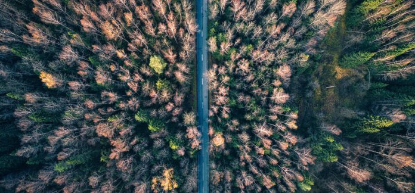

# Labs

```{only} html
<!-- 
<script src="https://platform.linkedin.com/badges/js/profile.js" async defer type="text/javascript"></script>
<div class="badge-base LI-profile-badge" data-locale="en_US" data-size="medium" data-theme="light" data-type="VERTICAL" data-vanity="pantelis" data-version="v1"><a class="badge-base__link LI-simple-link" href="https://www.linkedin.com/in/pantelis?trk=profile-badge">Pantelis Monogioudis</a></div>
               -->
<a href="https://twitter.com/monogioudis?ref_src=twsrc%5Etfw" class="twitter-follow-button" data-show-count="false">Follow @monogioudis</a><script async src="https://platform.twitter.com/widgets.js" charset="utf-8"></script>

```


## What is the purpose of this site?

This site hosts the assignments and projects given to my students from 2020 to date. 

